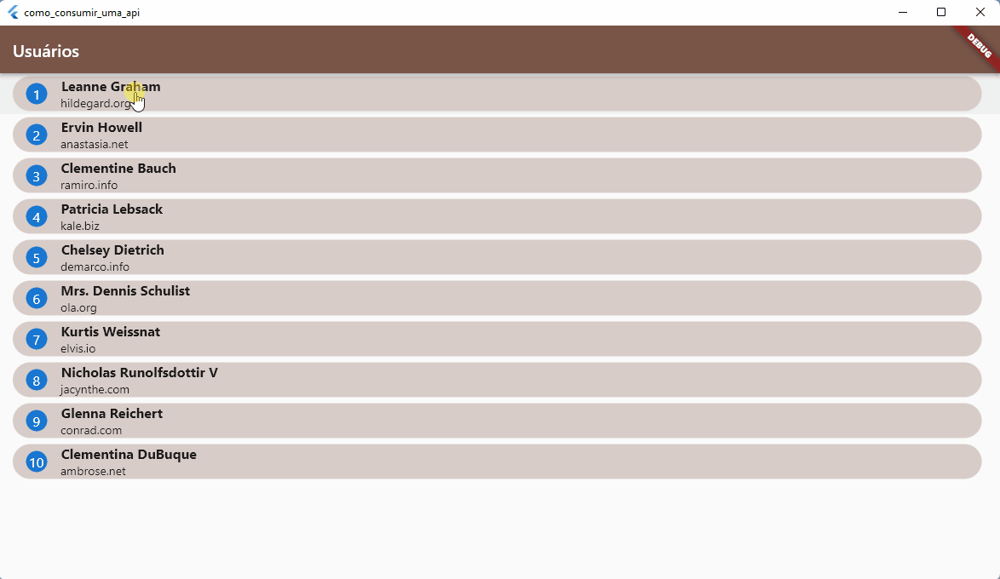

<h1 align="center">CONSUMO DE API</h1>

A API retona o nome com dados de dez pessoas.

## Objetivo

- Entender a dinâmica de pegar os dados via API;
- Para construção foi utilizado o package http.

### Autor

